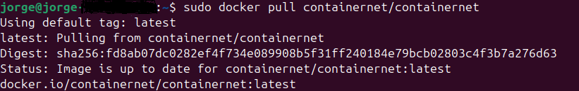
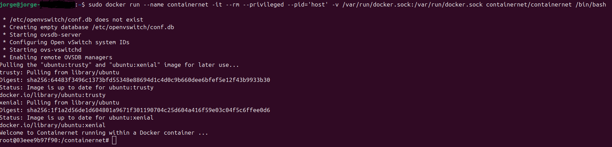
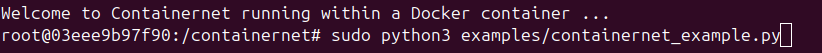
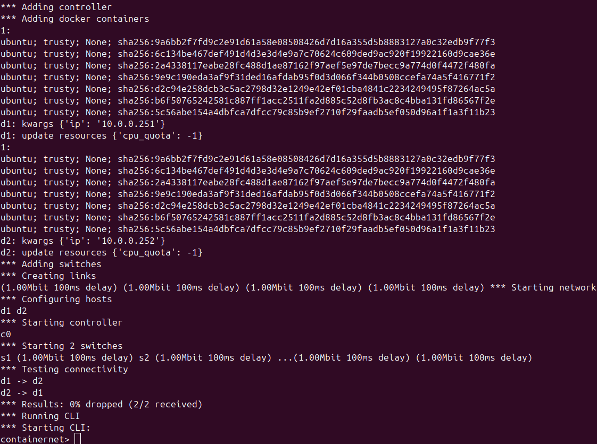
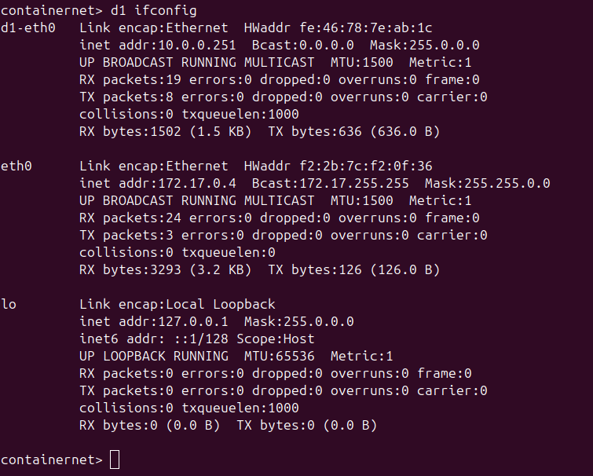
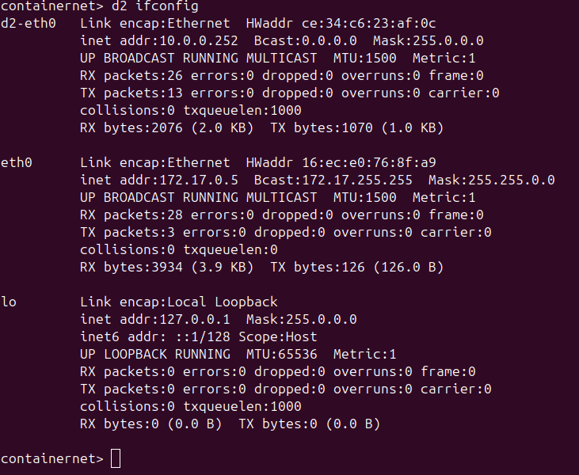
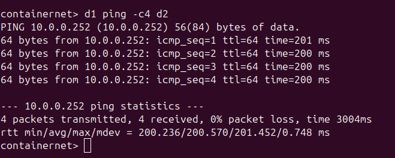
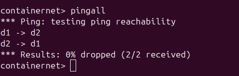

# Containernet
the simple project demostrates an example of containernet.
## Description
To simulate network many tools have been used before, containernet is a new tool that helps simulate networks protocols, and be able to test using containers as host, helping improve the testing capabilities.

## Pull Containernet
First we pull the containernet image

## Run the container
Run the image with the options pid host that allows us to see the utilization of each container as process by it self, and last but not least the /bin/bash that allows to get an interactive shell for the container.

## Run the script
Run the script that has the network and configuration. on this step containernet will pull Linux images to simulate each host and turn them on.

## Check 
check the configuration of the hosts

## Test
Run a ping test from host 1 to host 2, and later a pingall between all the hosts.

